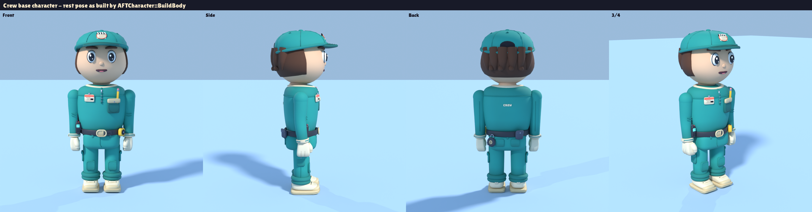

# Blender-Asset-Bibliothek (PEAK-Stil)

Stand 25.09.2026 · Branch `claude/happy-mendel-cyq16k`

## Kurzfassung

- **296 handmodellierte Meshes** ersetzen die bisher im C++ aus Grundkörpern gebauten Objekte:
  - das Studio mit Fassade, Straße, Lobby, Büro, Garderobe, Stage 4 (Tank, Insel, Steg, Kulisse), Projektionsraum und Lager, samt Möbeln, Stationen, Props und Bodenmarkierungen der Lieferzonen;
  - die Stadt mit Boulevard, Blocks, Gebäuden und dem Grand Cinema (Foyer, Saal mit Tribüne und 240 Sitzen, Leinwand, Marquee);
  - die Dream-Cars-Dealership mit Verkaufskiosk und Ausstellungsfläche;
  - die vier Fahrzeuge aus `FTEconomy.cpp`;
  - die 21 Shop-Artikel sowie optionale 3D-Schriftzüge.
- **Stil:** chunky low-poly mit kleinen Fasen, gesättigter FT-Palette und vielen kleinen Details (Nieten, Nähte, Beschläge, Kabel, Fugen) statt nackter Primitive.
- **Detail- und Qualitäts-Pass (25.09.):** Alle Modelle wurden auf ihrer bestehenden Form überarbeitet, ohne Layout, Pivots oder Silhouetten zu ändern. Siehe [Detail-Pass](#detail--und-qualitäts-pass).
- **Crew-Basisfigur (25.09.):** 36 Module einer einzigen, modularen Spielfigur: Kopf und minimales Gesicht, Haare, Kopfbedeckung, Brille, Kopfhörer, Oberteil, Latz, Gürtel, Funkgerät, Hose, Säume, Schuhe, Ärmel, Handschuhe und die Ego-Arme. Siehe [Crew-Basisfigur](#crew-basisfigur-modular).
- **Effekte (25.09.):** 16 Meshes für Partikel, Lichtkegel, Wasserflächen mit Schaum und Zonenmarkierungen. Siehe [Effekte](#effekte).
- **Export:** jedes Asset einzeln als FBX unter `Content/TheFinalTake/Meshes/<Bereich>/…`, im Unreal-Maßstab (1 Einheit = 1 cm), mit Pivot am Einbaupunkt.
- **Maßstab und Silhouette** werden automatisch gegen die Code-Geometrie geprüft (219 von 233 geprüften Meshes „ok“, 13 „close“, 1 „check“; 63 ohne Code-Gegenstück (Fahrzeuge, Schriftzüge, neue Dealership-Teile)). Details stehen in [`SourceArt/Blender/fit_report.md`](SourceArt/Blender/fit_report.md).
- **Zuordnung:** Welches Modell welches Code-Objekt ersetzt, steht in [`SourceArt/Blender/ASSET_MAPPING.md`](SourceArt/Blender/ASSET_MAPPING.md). Die Tabelle wird aus dem Manifest erzeugt.
- **Keine Gameplay- oder C++-Änderung.** Die Meshes liegen bereit, sind aber noch **nicht in die Actors eingebaut**. Siehe [Einbau](#einbau-empfehlung-nicht-umgesetzt).

## Wie die Assets entstanden sind

- **Blender-MCP (`blender-mcp`)** war in dieser Cloud-Sitzung nicht verfügbar. Auch `unreal-mcp` war nicht erreichbar (Verbindung abgelehnt).
- Stattdessen lief Blender 4.2 als Python-Modul (`bpy`) per Skript. Jede Form ist Code in `Tools/blender/assets/*.py` und damit reproduzierbar und versionierbar.
- Dieselben Skripte laufen auch in einer Blender-Instanz mit blender-mcp oder im GUI (`blender --python Tools/blender/build_all.py`).
- **Zum Anschauen in Blender** liegen fertig zusammengesetzte Szenen unter `SourceArt/Blender/`:
  - `Studio.blend`: das ganze Studio mit allen Platzierungen (Instanzen teilen sich ihr Mesh), die Laufzeit-Objekte (Shop-Artikel, Filmrolle) stehen in einer Reihe vor dem Gebäude.
  - `City.blend`: Boulevard, Gebäude, Grand Cinema und Dream Cars, die vier Autos auf den Drehscheiben.
  - `Catalog.blend`: jedes Mesh einmal, im Raster, eine Collection pro Ordner.
  - `Characters.blend`: die Crew-Basisfigur, zusammengesetzt wie im Spiel: Idle-Pose, Ruhepose, das Ausdrucks-Set, die Modul-Varianten und die Ego-Arme.
  - Decken und Dächer liegen in einer eigenen, ausgeblendeten Collection, damit man direkt in die Räume schaut. Die Ansicht ist auf den cm-Maßstab eingestellt (Clipping, Vertex-Farben, Kamera).
- **Geprüft wurde:**
  - FBX-Reimport jedes Assets in Blender (Bounds, Dreiecke, Material-Slots);
  - Cycles-Vorschaubilder;
  - automatischer Maßvergleich mit dem C++.
- **Nicht geprüft:** Import, Materialwirkung, Beleuchtung und Performance in Unreal. Es gab keine Unreal-Sitzung.

## Aufruf

```bash
pip install bpy==4.2.0                                   # Python 3.11; alternativ: blender -b --python ... -- <args>
python3 Tools/blender/build_all.py                       # alles: FBX, Previews, Kontaktbögen, Manifest, Fit-Report, .blend-Szenen
python3 Tools/blender/build_all.py --only Vehicles       # Teilmenge (Name/Ordner, Wildcards erlaubt), Manifest wird ergänzt
python3 Tools/blender/build_all.py --fit-only            # nur Maßprüfung + Platzierungen neu rechnen (ohne Rendern/Export)
python3 Tools/blender/build_all.py --blend-only          # nur die .blend-Szenen neu schreiben (= python3 Tools/blender/scenes.py)
python3 Tools/blender/scenes.py --web                    # zusätzlich GLB-Dateien für einen Browser-Viewer (nicht eingecheckt)
python3 Tools/blender/character_sheet.py                 # Crew-Figur: Characters.blend + Turnaround/Gesicht/Module/Ego-Arme
python3 Tools/blender/character_sheet.py --no-render     # nur Characters.blend
python3 Tools/blender/render_overview.py                 # Übersichtsbilder: Code-Blockout neben den Blender-Assets
python3 Tools/blender/write_mapping.py                   # SourceArt/Blender/ASSET_MAPPING.md aus dem Manifest
python3 Tools/blender/layout/extract_layout.py           # Shell-Layout neu aus dem C++ lesen (braucht g++)
python3 Tools/blender/layout/cppactor.py AFTStageLight   # Komponentenbaum eines Actors aus dem C++ anzeigen
python3 Tools/blender/layout/cppactor.py --spawns        # alle Actor-Instanzen aus FTMapBuilder.cpp
```

Ein kompletter Build dauert auf 4 Kernen rund 15 Minuten, der Großteil davon sind die Cycles-Previews; die drei .blend-Szenen kommen mit gut einer Minute dazu. Die Übersichtsbilder brauchen weitere rund 10 Minuten.

`Catalog.blend` (rund 60 MB) ist nicht eingecheckt; `scenes.py` erzeugt sie lokal. Eingecheckt sind `Studio.blend` und `City.blend`.

## Ordnerstruktur

| Pfad | Inhalt |
|---|---|
| `Content/TheFinalTake/Meshes/Shared/{Props,Posters,Street,Nature,Decals}` | Mehrfach genutzte Props (Pflanze, Kiste, Flightcases, Kegel, Poster, Laterne, Palme, Felsen, Bodenpfeile) |
| `Content/TheFinalTake/Meshes/Studio/{Exterior,Lobby,Office,Wardrobe,Stage4,TankSet,Projection,Warehouse}` | Studio-Gebäude: Hüllen, Decken, Möbel, Einbauten |
| `Content/TheFinalTake/Meshes/Studio/{Stations,Props,Doors,Decals}` | Actor-Meshes (Stationen, Requisiten, Türen) inkl. beweglicher Unterteile, Bodenmarkierungen der Delivery-Bays |
| `Content/TheFinalTake/Meshes/Studio/ShopItems/{Accessories,Props,Effects,SharkKits,SetPieces}` | die 21 Studio-Supply-Artikel |
| `Content/TheFinalTake/Meshes/City/{Boulevard,Buildings,GrandCinema}` | Stadt, Gebäude, Grand Cinema |
| `Content/TheFinalTake/Meshes/{Studio,City}/Signs` | optionale 3D-Schriftzüge für die statischen TextRender-Schilder |
| `Content/TheFinalTake/Meshes/Dealership`, `…/Vehicles` | Dream Cars, Fahrzeuge (Karosserie + Räder getrennt) |
| `Content/TheFinalTake/Meshes/Characters/{Face,HairHeadwear,Body,FirstPerson}` | Module der Crew-Basisfigur (Einheitsraum der ersetzten Komponente) |
| `Content/TheFinalTake/Meshes/FX/{Particles,Beams,Water,Zones}` | Partikel, Lichtkegel, Wasser und Schaum, Zonenmarkierungen |
| `SourceArt/Blender/asset_manifest.json` | maschinenlesbar: Pfade, Ersetzt, Pivot, Platzierungen, Sockets, Bounds, Tris, Fit, Einbau |
| `SourceArt/Blender/ASSET_MAPPING.md`, `fit_report.md` | Zuordnungstabelle, Maßprüfung |
| `SourceArt/Blender/Previews/` | ein Bild pro Asset, Kontaktbögen `Sheet_*.png`, Übersichten `Overview/*.png` (Code-Blockout links, Blender-Assets rechts) |
| `SourceArt/Blender/{Studio,City,Catalog,Characters}.blend` | zusammengesetzte Szenen zum Anschauen in Blender (siehe oben) |
| `SourceArt/Blender/layout/shell_layout.json` | alle Primitive der Studio-/Stadt-Hülle mit Datei:Zeile |
| `Tools/blender/` | Pipeline: `build_all.py`, `ftb/` (Kern, Palette, Export, Render, Layout), `assets/` (Modelle), `layout/` (C++-Auswertung), `fonts/` (OFL-Schriften) |
| `Tools/unreal/ft_blender_import.py` | Import-Helfer für den Unreal-Editor (**ungetestet**) |

## Konventionen

- **Einheiten und Achsen:**
  - Modelliert wird direkt im Unreal-Raum: cm, X vorne, Y rechts, Z oben.
  - Der FBX-Export konvertiert nach Blender/FBX. Beim Import in Unreal gelten: Uniform Scale 1, *Convert Scene* an, *Force Front X Axis* aus.
- **Pivots:**
  - **Architektur** ist weltausgerichtet um einen festen Pivot modelliert und wird ohne Rotation platziert.
  - **Möbel und Props** haben den Pivot in der Bodenmitte.
  - **Actor-Meshes** haben den Pivot im Ursprung der ersetzten Komponente, mit denselben Achsen.
  - **Mehrfach-Props** (Pflanze, Kiste, Palme, Felsen …) sind in einer Referenzgröße modelliert. Die Skalierung entspricht dem Code-Aufruf, z. B. `Crate(Size)` → `Size/100`.
  - Jede Platzierung steht im Manifest.
- **Polycount (nach dem Detail-Pass):** Median 2 369 Dreiecke pro Mesh, 90 % unter 13 544, zusammen 1 715 734 (vorher 629 496).
  - Requisiten (Studio/Shared Props): Median 1 764, höchstens 6 980. Sie eignen sich weiter für Instancing und ISM.
  - Die großen Hüllen tragen den Löwenanteil, weil große Flächen für die Farbvariation in ein ~70-cm-Raster unterteilt sind: `SM_Stage4_Walls` 82 772, `SM_City_Bld_HotelContinental` 59 560, `SM_Stage4_EntryWall` 44 720, `SM_Cinema_Shell` 43 580. Für diese Meshes Nanite einschalten.
- **Shading:**
  - Weiche Fasen statt Texturen. Kanten über 50° sind hart, dazu kommen Weighted Normals.
  - Leichte Handarbeits-Unregelmäßigkeit und etwas Ambient Occlusion in den Vertex-Farben.
  - Keine Texturen. Jedes Mesh hat einen Box-projizierten UV-Kanal `UVMap` (1 UV-Einheit = 1 m) für Detail-Normalmaps oder Tiling-Masken; Lightmap-UVs beim Import erzeugen lassen.

### Materialien und Vertex-Farben

Alle Farben sind Vertex-Farben (`Col`, sRGB). Die Material-Slots tragen feste Namen:

| Slot | Verwendung | Vertex-Farbe |
|---|---|---|
| `M_FT_Vertex` | alles Opake | RGB = Farbe, **A = Rauheit** |
| `M_FT_VertexGlow` | Leuchtteile (Birnen, Neon, Displays, Linsen) | RGB = Farbe, **A = √(Emissive/20)** → Emissive = RGB·20·A² (gleiche Skala wie der Emissive-Wert im Code) |
| `M_FT_VertexGlass` | Glas | RGB = Tönung, Opazität 0,35 im Material |
| `M_FT_CarBody` / `M_FT_CarTrim` | Fahrzeuglack / Zierfarbe | Standardfarben aus `FTEconomy.cpp` (Body/Trim). Das Material hat einen Farbparameter zum Umlackieren. |
| `M_FT_CrewPaint` | vom Code eingefärbte Figurenteile (Haut, Haare, Shirt, Hose, Handschuhe …) | fast weiß mit dunkleren Nähten und Paneelen, **A = Rauheit**; das Material multipliziert mit der Farbe aus `FTVis::Paint` (Custom Primitive Data 0–2) |
| `M_FT_Water` | Wasserfläche (bestehendes Material des Codes) | Uferband heller, leichte Kaustik-Fleckung |
| `M_FT_BeamGlow` | Lichtkegel | RGB = Farbe, **A = Helligkeit**; unlit, additiv, zweiseitig, mal der Farbe aus `FTVis::Paint` |

- Diese Materialien existieren in Unreal noch nicht. `Tools/unreal/ft_blender_import.py` legt sie per `create_materials()` an (**ungetestet**).
- Das Skript linearisiert die sRGB-Vertex-Farben mit dem Parameter `VertexColourGamma` = 2,2. Wirken die Farben zu dunkel, den Wert auf 1,0 setzen.
- Vom Code eingefärbte oder zur Laufzeit leuchtende Teile bleiben Code-Teile, weil der Code sie per Custom Primitive Data umschaltet. Beispiele: Kippschalter- und Farbkappen am Lichtpult, Statuslampen, Pegelanzeigen, der Schalter-Leuchtpunkt an den Effektgeräten, Linsenglühen am Projektor.
- Im Manifest steht bei jedem Asset unter `integration` bzw. `hookup`, welche Teile beim Code bleiben.

## Detail- und Qualitäts-Pass

Ausgangslage: Formen und Positionen stimmten, die Modelle wirkten aber wie 1:1-Blockouts der Code-Primitive. Der Pass baut auf den vorhandenen Modellen auf. Nichts wurde neu gebaut, kein Layout, Pivot oder Socket verändert.

1. **Oberflächen-Pass für alle opaken Teile** (`Tools/blender/ftb/core.py`, steckt komplett in den Vertex-Farben, also ohne Texturen und ohne Material-Mehraufwand):
   - Jedes Teil ist minimal anders getönt (±4,5 % Helligkeit, ±2 % Farbton). Wiederholte Bretter, Kacheln und Props wirken dadurch nicht geklont.
   - Große Flächen sind in ein Raster von rund 70 cm unterteilt, damit Variation darauf sichtbar wird: großflächige Fleckung und dunklere Schmutzflecken, am Boden stärker.
   - Konvexe Fasenkanten sind heller abgegriffen, mit gelegentlichen Abplatzern. Innenecken tragen etwas Schmutz, Oberseiten sind minimal heller, Unterseiten dunkler.
2. **Detail-Kit** (`Tools/blender/ftb/detail.py`): Schrauben, Nieten, verschraubte Platten, Etiketten, Lüftungsgitter, Lochgitter, Rahmen und eingelassene Paneele, Fugen, Warnstreifen, Griffe, Drehknöpfe, Scharniere, Gummifüße, Eckschützer, Kabel mit Durchhang und Kabelbindern, LEDs, Schablonenschrift, Kratzer, Gaffer-Tape, Räder mit Felge, Profil und Radmuttern, Lenkrollen, Patchfelder, Rack-Einschübe, Winkel. Mit `D.Local(...)` sitzen Details auch auf schrägen oder gedrehten Flächen, etwa auf den geneigten Pultflächen.
3. **Handarbeit pro Asset**, in allen Modulen und ausdrücklich auch auf Seiten und Rückseiten. Beispiele:
   - **Stationen:**
     - Leuchtturm mit Wartungsleiter, Konsolen unter der Galerie, verschraubten Bullaugen und Rettungsring.
     - Scheinwerfer mit Lüftung, Torblenden-Scharnieren, Rückseitenpanel und Kabel; Stativ mit Sandsack und Kabelrolle.
     - Licht- und Tonpult mit Flightcase-Beschlägen, Patchfeld und Kabeln auf der Rückseite, Kaffeetasse und Cue-Zettel.
     - Effektmaschinen mit Profilreifen, Schiebebügel, Kühlrippen, Manometern und Sandsäcken.
     - Hai-Rig mit Energiekette, Anschlagpuffern und Hydraulikschlauch; Hai mit Formnaht, Nasenlöchern, Narben und Montageplatte.
     - Kamera-Dolly mit Akkubox und Monitor-Sonnenblende; Projektor mit Filmweg zwischen den Spulen.
   - **Requisiten und Türen:** Stage-4-Tor mit Nietreihen, Laufrollen, Griff und Kickleiste auf beiden Seiten; Besetzungsliste an der Garderobentür; Rettungsboot mit Paddel, Kanister, Ventilen und Kennung; Pinnwand mit Pins, rotem Faden und Polaroids.
   - **Räume:** Steckdosen, Schalter, Feuerlöscher, EXIT-Schilder, Kabelkanal, Sprinkler, Rauchmelder, feine Putzrisse und Scheuerspuren. Dazu im Büro Heizkörper und Urkunden, in der Garderobe Garderobenhaken, Spiegel und Spot-Schiene.
   - **Stage 4:** gepolsterte Warnschutz-Manschetten an allen Stützen, Fußplatten mit Ankerbolzen, Kabelhaken mit Kabelrollen, Sprinklerleitungen und Kabeltrasse unter der Decke, eine QUIET-Lampe am Tor. Die Kulisse hat eine Rückseite mit Latten und Gewichten.
   - **Außen und Stadt:**
     - Risse, Unkraut und Kaugummiflecken im Gehweg, Teerfugen, Klimageräte, Überwachungskamera, Fallrohre, Stromzähler, Plakate und Tags.
     - Die Stadtgebäude haben jetzt auch an Seiten und Rückseite Fenster, umlaufendes Gesims, Hintertür und Feuerleiter.
     - Das Kino hat Seitenausgänge, Dachluken und Saal-Lautsprecher.
   - **Dealership und Fahrzeuge:** Entwässerungsrinne, Stellplatznummern, Aussteifung hinter dem Schild, Dachrinne. Die Autos haben Unterboden, Achsen, Tank, Auspuff, Scheibenwischer, Antenne, Tankdeckel, Schmutzfänger und Seitenblinker.
4. **Regeln:**
   - Details stehen nur wenige Zentimeter über und bleiben innerhalb der Silhouette.
   - Teile, die der Code einfärbt oder leuchten lässt, bleiben frei sichtbar. Dabei sind zwei Fehler der ersten Fassung behoben: Das Meter-Gehäuse am Tonpult verdeckte die Pegelanzeigen `Meter0-5` des Codes, die Titeltafel am Lichtpult hätte den Schriftzug „LIGHTING“ verdeckt. Das Gehäuse steht jetzt hinter den Anzeigen, die Tafel hinter dem Schriftzug.
   - Flächen verschiedener Teile liegen nie exakt in einer Ebene; die automatische Entkopplung gilt jetzt auch für Meshes mit mehr als 50 Teilen.
5. **Prüfung:** Die Maßprüfung ist unverändert (219 ok, 13 close, 1 check, 63 ohne Code-Gegenstück), jedes Asset wurde vor und nach dem Pass verglichen. Der FBX-Reimport ist für alle 296 Assets ok.

## Crew-Basisfigur (modular)

Umsetzung der Art Direction: **eine** ausgearbeitete Basisfigur, die die Bildsprache aller Spielfiguren festlegt. Modell und Werkzeuge: `Tools/blender/assets/characters.py`, `Tools/blender/character_sheet.py`.



- **Proportionen:** übergroßer, weicher Kopf (rund ein Drittel der Körperhöhe), kompakter Rumpf, schlanke und etwas verlängerte Arme mit leichtem Ellbogenknick, Fäustlings-Handschuhe, klobige Sneaker mit hochgezogener Spitze. Alles ist rund und gefast (Subdivision-Käfige, dichte Drehkörper), nichts sieht nach Blockout oder Klötzchenfigur aus.
- **Gesicht, bewusst minimal:** glänzende weiße Augen mit feiner Kontur, große Pupillen mit zwei Glanzlichtern, pillenförmige Brauen, ein kleiner dunkler Mund mit Zunge, ein winziger Nasenknubbel. Keine Hautdetails. Die Mimik kommt aus `AFTCharacter::UpdateFace`, das Augen, Pupillen, Brauen und Mund weiter skaliert und dreht, dazu Kopf- und Körperhaltung. Das Ausdrucks-Set zeigt `Crew_Base_Face.png`.
- **Crew-Identität, dezent:** Arbeitshemd mit zweifarbiger Schulterpasse, Reißverschlussleiste, Brusttasche mit Bleistift, Crew-Ausweis mit Klappen-Symbol, kleiner „CREW“-Print auf dem Rücken; Werkzeuggürtel mit Maßband, Gaffa-Rolle am Karabiner und Tasche; Funkgerät mit leuchtendem Display; Cap mit gesticktem Klappen-Abzeichen; Arbeitshose mit Kniepolstern und Cargotasche.
- **Modular:** Jedes Modul ist ein eigenes Mesh und ersetzt genau die Komponente, die der Code schon einzeln ein- und ausblendet und einfärbt. So bleiben Kostüme, Crew-Looks und Shop-Accessoires unverändert steuerbar:

| Slot | Code-Komponenten | Wechsel |
|---|---|---|
| Gesicht | `Head` (+`Nose`), `EyeL/R`, `PupilL/R`, `BrowL/R`, `Mouth`, `EarL/R` | immer an; Ohren unter Kapuzen aus |
| Haare | `HairTop`, `HairBack`, `HairBun` | `HairStyle` des Crew-Looks; unter Mützen, Hüten, Kapuzen, Helmen aus |
| Kopfbedeckung | `CapCrown`, `CapBrim`, `CapBadge`; Anker `AccHead` | `bCap`; Kostüm-Kopfteile oder Shop-Hut ersetzen sie |
| Brille | `GlassL/R`; Anker `AccFace` | `bGlasses`; Shop-Sonnenbrille ersetzt sie |
| Kopfhörer | `PhoneL/R`, `PhoneBand` | `bPhones` |
| Oberteil | `Torso` (+Tasche, Bleistift, Ausweis), `Collar`, `ArmL/R`, `Bib` | Farben Shirt/Sleeve/Bib; Kostüme färben um oder decken ab |
| Ausrüstung | `Belt` (+Schnalle), `Walkie` (+Antenne, Display) | von Kostümen ausgeblendet |
| Handschuhe | `HandL/R`, `FPHandL/R`, `FPCuffL/R` | Farbe Glove / Crew-Akzent |
| Hose | `Pelvis`, `LegL/R`, `CuffL/R` | Farbe Pants/Legs |
| Schuhe | `ShoeL/R` (+Sohlen, Schnürsenkel) | Farbe Shoe |
| Kostüm-Ebene | `LG*`, `SH*`, `RC*`, `FK*` an `Neck`/`Chest`/`Hips`/`Shoulder` | ein Mesh pro Kostümteil über der Basis-Silhouette |

  Weitere Kostüme (Cowboy, Astronaut, Monster, Detektiv, Pirat, Ritter, Stuntperson) hängen an denselben Gelenken und blenden die Slots aus, die sie verdecken, genau wie die vier Kostüme in `SetCostumePartsVisible`. `Crew_Base_Modules.png` zeigt dieselbe Figur mit getauschten Modulen.
- **Einbau ohne Gameplay-Änderung:** Jedes Mesh liegt im **Einheitsraum des ersetzten Primitivs**. Es ist in echter Größe im Komponentenrahmen modelliert und dann durch `Size/100` geteilt und um die Komponentenrotation zurückgedreht. `SetStaticMesh` auf der Komponente genügt: Gelenke, Skalierung, Blinzeln, Ausdrücke, Sichtbarkeit und `FTVis::Paint` greifen weiter. Verschmolzene Kleinteile (Nase, Tasche, Ausweis, Sohlen, Schnürsenkel, Daumen …) stehen pro Asset unter `integration`; diese Code-Teile werden ausgeblendet.
- **Polycount:** Figur mit Cap 58 742 Dreiecke (ohne Cap 53 682), Ego-Arme 8 556. Das passt zu vier Spielern; für mehr Figuren LODs erzeugen.
- **Prüfung:** Die Maßprüfung vergleicht die echte Größe mit dem Code-Primitiv im Komponentenrahmen. 31 von 36 sind „ok“. Brillenbügel, Kopfhörerbügel und -kabel sowie die Latz-Träger ragen bewusst über ihr Primitiv hinaus; das steht als Notiz im Fit-Report. `character_sheet.py` setzt die Figur aus dem nachgespielten Komponentenbaum zusammen (`layout/cppactor.py`), mit den Crew-Farben aus `GetCrewLook`.
- **Noch offen:** Die vier vorhandenen Kostüme (Rettungsschwimmer, Hai, Regenmantel, Schaumstoff-Ritter) und die Identitätsmarke `Marker` sind nicht neu gebaut. Laut Art Direction kommt zuerst die Basisfigur; die Kostüme folgen auf derselben Basis.

## Effekte

Modell: `Tools/blender/assets/effects.py`. Simulation, Ausrichtung, Flutstand und Zonenvolumen bleiben im Code.

| Mesh | Ersetzt | Einbau |
|---|---|---|
| `SM_FX_RainStreak`, `SM_FX_Droplet`, `SM_FX_Spark`, `SM_FX_SmokePuff`, `SM_FX_FoamBlob`, `SM_FX_WindStreak`, `SM_FX_Confetti`, `SM_FX_Bubble` | Einheitsformen der `UFTChunkyParticles` (Regen, Spritzer, Funken, Rauch, Schaum, Wind, Konfetti, Seifenblasen) | nach `Configure()` `SetStaticMesh`; Material und Farbe setzt weiter der Code. Die Meshes füllen die ±50-cm-Box wie die alte Form, +Z zeigt in Flugrichtung (Stretch). |
| `SM_FX_LightBeam` | `GlowCone()` (Leuchtturm, Bühnenlichter), Suchscheinwerfer am Kino | Einheitskegel (Spitze +Z). Verschachtelte offene Kegel mit Helligkeitsabfall zum Rand und zum Ende, Lichtstrahlen, Staubpartikel; Material `M_FT_BeamGlow`. |
| `SM_FX_ProjectorBeam` | `AFTProjector::Beam` | wie oben, mit mehr Filmstrahlen, Staub und leichten Bändern |
| `SM_FX_WaterSurface` | `SM_FT_WaterGrid` (Tankwasser, Flutebene) | feineres Raster mit leichter Welligkeit, hellerem Uferband und Kaustik in den Vertex-Farben; Material `M_FT_Water` |
| `SM_FX_TankFoam` | neu: Schaumkante am Tankrand | statisches Mesh auf der Wasserlinie (1800, 100, −50) |
| `SM_Zone_LungeMark`, `SM_Zone_Safe_Harpoon`, `SM_Zone_Safe_Shelf`, `SM_Zone_Safe_SharkStation` | Markierungsstreifen von `AFTZone` | echte Größe am Boden der Zone: gestrichelter Leuchtring mit Pfeilen und Haiflosse; Safe-Zonen aus handverlegtem Leuchtband mit schraffierten Ecken und „SAFE“-Schablonen. In `FTMapBuilder` `Mark = None` setzen; das Label bleibt TextRender. |

- In Blender zeigen die Previews unter `SourceArt/Blender/Previews/FX/` die Meshes; in `Studio.blend` liegen Tankwasser, Schaum und Zonen an ihren Plätzen, Partikel und Kegel in der Showcase-Reihe.
- Nicht gebaut: die `TapeX`-Variante (in der Karte nicht benutzt) und Interaktionsvolumen.

## Maßstab- und Silhouettentreue

Die Modelle wurden nicht nach Augenmaß, sondern gegen die tatsächliche Code-Geometrie gebaut und geprüft:

1. **Studio- und Stadt-Hülle** (`FTStudioShell.cpp`, `FTCity.cpp`):
   - `extract_layout.py` kompiliert die Original-`Build*()`-Funktionen mit kleinen Stubs (`layout/ue_stubs.h`).
   - Dabei wird jedes `Add()`/`Text()`/`Light` mit Datei, Zeile und Helfer-Kontext (`Plant`, `Crate`, `Building` …) protokolliert.
   - Ergebnis: `shell_layout.json` mit rund 2 800 Einträgen. Daraus kommen Platzierungen, Pivots und die Liste der ersetzten Primitive.
2. **Actors** (Stationen, Props, Türen, Kino-Actors):
   - `layout/cppactor.py` ist ein kleiner Interpreter für das C++-Subset der Konstruktoren.
   - Er spielt Konstruktor und `OnConstruction` (wo nötig auch `BeginPlay`) mit den Instanz-Einstellungen aus `FTMapBuilder.cpp` nach, etwa `StandHeight`, `AimPitch`, `RailHalfLength`, `TrackLength` oder `Effect`.
   - Daraus entstehen der Komponentenbaum, die Bounds pro Mesh und die **Weltplatzierungen auch der beweglichen Unterteile** in ihrer Ruhepose: Scheinwerferköpfe, Hebel, Rollen, Hai, 36 Marquee-Birnen, 240 Kinositze.
3. **Shop-Artikel:** Die Teilelisten kommen direkt aus `UFTEconomyConfig` (`FTEconomy.cpp`).
4. **Vollständigkeit:**
   - Jedes der 2 686 sichtbaren Primitive der Studio- und Stadt-Hülle ist genau einem Mesh zugeordnet. Keins fehlt, keins ist doppelt; das ist per Skript geprüft.
   - Bei den Actors bleiben nur die Teile beim Code, die der Code zur Laufzeit einfärbt, leuchten lässt oder ersetzt:
     - Tür-Keylamps, Pinnwand-Pins, das Kassen-Display im Supply-Shop;
     - Linsenglas, Aufnahmelampe und Monitorbild der Filmkamera;
     - Power-Lampe und Farbkappen am Lichtpult, Status-Lampen, Lampen und Pegel am Tonpult;
     - die Rig-Knöpfe 0/1/2/4 und die Kit-Lampe am Hai-Rig;
     - die Leinwand selbst (`Sheet`), Linsenglühen und Power-Lampe am Projektor, die Suchscheinwerfer-Kegel.

**Übersichtsbilder** (`SourceArt/Blender/Previews/Overview/`): Studio-Grundriss, Stage 4, Studio-Straße, Stadt-Grundriss, Boulevard, Dealership und Kinosaal. Links steht jeweils das heutige Code-Layout (Hülle plus nachgespielte Actor-Bauteile, grau), rechts die neuen Meshes an ihren Manifest-Platzierungen.

- **Prüfmaß:** Bounding-Box-Abweichung zu den ersetzten Code-Teilen. Runde Formen werden analytisch gemessen (Ellipsoid, Zylinder, Kapsel, Torus), die Assets exakt über ihre Vertices.
- **Status:**
  - ok: ≤ 10 cm oder ≤ 8 % der Ausdehnung;
  - close: ≤ 20 %;
  - check: mehr als 20 %.
- **Ergebnis:** 219 von 233 geprüften Meshes „ok“, 13 „close“, 1 „check“; 63 ohne Code-Gegenstück (Fahrzeuge, Schriftzüge, neue Dealership-Teile). Jede nicht-„ok“-Zeile trägt im Fit-Report eine Begründung, zum Beispiel:
  - Kinositz mit Standfuß bis zur Stufe (im Code schweben die Sitzboxen 36 cm darüber);
  - Stützbeine der Hai-Schiene bis zum Tankboden;
  - Palmen und Felsen organisch statt Kugelstapel;
  - Schwanenhalslampe am Lichtpult.
- **Fahrzeuge:** Es gibt keine Code-Geometrie. Maße, Sitzzahl, Stil und Farben folgen `FTEconomy.cpp`:

| Fahrzeug (`FTEconomy.cpp`) | Karosserie-Mesh | L×B (cm, inkl. Spiegel) · Höhe über Boden | Sitze (Sockets) | Räder |
|---|---|---|---|---|
| Studio Van (`Car.StudioVan`, Van, Cream/Teal) | `SM_Veh_StudioVan_Body` | 532×258 · 296 | 4 (Seat_0, Seat_1, Seat_2, Seat_3) | `SM_Veh_StudioVan_Wheel` |
| Checker Cab (`Car.CheckerTaxi`, Taxi, Yellow/Charcoal) | `SM_Veh_CheckerTaxi_Body` | 524×234 · 192 | 4 (Seat_0, Seat_1, Seat_2, Seat_3) | `SM_Veh_CheckerTaxi_Wheel` |
| Coral Muscle Car (`Car.MuscleCar`, Muscle, Coral/Cream) | `SM_Veh_MuscleCar_Body` | 502×234 · 137 | 2 (Seat_0, Seat_1) | `SM_Veh_MuscleCar_WheelFront`, `SM_Veh_MuscleCar_WheelRear` |
| Premiere Limousine (`Car.StarLimo`, Limo, Navy/Magenta) | `SM_Veh_StarLimo_Body` | 750×242 · 155 | 4 (Seat_0, Seat_1, Seat_2, Seat_3) | `SM_Veh_StarLimo_Wheel` |

Die Karosserien haben Sockets `Wheel_FL/FR/RL/RR`, `Seat_n` und `Exhaust*`. Die Räder sind eigene Meshes mit Pivot in der Nabe, damit sie drehen können.

## Befunde im bestehenden Code (nicht geändert)

- **Vier Schildtafeln sind um 90° gegen ihren eigenen Schriftzug verdreht.** Der TextRender steht jeweils vor der Tafel auf der Achse, in die er zeigt, die Tafel ist aber auf der anderen Achse dünn. Der Text steht dadurch quer zur Tafel:

  | Stelle | Tafel im Code | Schriftzug |
  |---|---|---|
  | `FTCity.cpp:302` | `FVector(20, 1200, 240)`, ragt durch die Rückwand | „DREAM CARS“, Yaw −90; Birnenreihe und Pfosten entlang X |
  | `FTStudioShell.cpp:585` | `FVector(4, 400, 90)` | „RECEPTION“, Yaw 90 |
  | `FTStudioShell.cpp:977` | `FVector(10, 200, 70)` | „PROJECTION ^“, Yaw 90 |
  | `FTCity.cpp:328` | `FVector(12, 90, 90)` | „P“ (Parkplatz), Yaw 90 |

  - Die Meshes folgen der erkennbar beabsichtigten Ausrichtung (`BOARD_FIXES` in `Tools/blender/ftb/layout.py`). Beim Einbau die Code-Tafel ausblenden.
  - Die Übersichtsbilder zeigen links die Tafeln so, wie der Code sie heute baut.
- **Hai-Schiene:** Die Länge kommt aus `RailHalfLength` (Level: 180 → 460 cm, in `OnConstruction` skaliert). Das Mesh ist für diesen Wert gebaut; bei anderen Werten Y skalieren.
- **Hai in Ruhepose:** `OnConstruction` setzt `SharkRoot` auf `WaterHeight − 150`, also unter den Tankboden, bis der Hai auftaucht. Hai, Kiefer und Arm sind deshalb in dieser Ruhepose platziert und fahren mit `SharkRoot` mit.

## Einbau (Empfehlung, nicht umgesetzt)

Gameplay bleibt unverändert, wenn die neuen Meshes **nur die Optik** übernehmen und die Code-Primitive mit Kollision unsichtbar, aber vorhanden bleiben.

1. **Materialien und Import:** `ftb.create_materials()` und `ftb.import_all()` aus `Tools/unreal/ft_blender_import.py` ausführen (ungetestet).
2. **Vergleich:** `ftb.build_preview_level()` baut ein separates Level `L_BlenderAssetPreview` mit allen Meshes an ihren Platzierungen. Die Spielkarte bleibt unberührt.
3. **Hüllen (Studio/Stadt):**
   - Die Meshes an ihre Manifest-Platzierungen setzen, z. B. als Komponenten in `AFTStudioShell`/`AFTCityShell` oder als Actors im Map-Builder.
   - Die ersetzten Deko-Instanzen weglassen und die Solid-/Blocker-Instanzen als unsichtbare Kollision behalten.
   - Das braucht eine kleine C++-Änderung, die hier bewusst **nicht** gemacht wurde.
4. **Actors:** Für jedes Mesh nennt das Manifest (`hookup`) die Zielkomponente, zum Beispiel:
   - „auf Komponente `Lever` setzen, Skalierung 1, Rotation behalten“;
   - „als StaticMeshComponent an `Head` hängen, Code-Teile Yoke/Body/… ausblenden“.
   Bewegliche Teile (Hebel, Köpfe, Rollen, Hai, Kiefer, Boot, Kamera-Dolly …) sind eigene Meshes, damit die bestehende Animationslogik unverändert greift.
5. **Mehrfach-Props und Instanzen:**
   - Kinositze und Publikum sind als ISM-Meshes gedacht; sie ersetzen die Box-, Kapsel- und Kugel-Meshes der vorhandenen ISMs.
   - Pflanzen, Kisten, Laternen usw. passen per Platzierung und Skalierung.
6. **Fahrzeuge:** Karosserie plus vier Räder an den Sockets. Das Lackmaterial kann Body/Trim aus `FFTVehicleDef` übernehmen.
7. **Schriftzüge:** Die `SM_Sign_*`-Meshes sind optional. Sie stehen genau an den TextRender-Positionen; beim Einsatz den TextRender ausblenden.

## Nicht enthalten / offen

- **Figuren:** Die Crew-Basisfigur ist gebaut; die vier Kostüme und die Identitätsmarke noch nicht (siehe [Crew-Basisfigur](#crew-basisfigur-modular)).
- **Bleiben Code-Effekte:** Interaktionsvolumen und die ungenutzte `TapeX`-Markierung. Partikel, Kegel, Wasser und Zonenmarkierungen haben jetzt Meshes (siehe [Effekte](#effekte)).
- **Bleiben TextRender:** Nummern und Titel der Delivery-Bays sowie die Schilder, sofern die optionalen `SM_Sign_*`-Meshes nicht genutzt werden.
- **Dealership (Arbeitspaket 4) ist geplant, nicht final:** Drehscheiben, Kiosk, Preisaufsteller, Wimpel, Flutlicht und Tube-Man sind neue Meshes ohne Code-Gegenstück. Die Platzierungen sind Vorschläge auf den vorhandenen Stellplätzen.
- **Fehlt noch:** LODs (Unreal-Auto-LOD oder Nanite nutzen) und Kollisions-Meshes (Kollision bleibt beim Code).
- **Unreal-seitig ungetestet:** Import-Einstellungen, Vertex-Farb-Gamma und Materialwirkung beim ersten Import prüfen.
